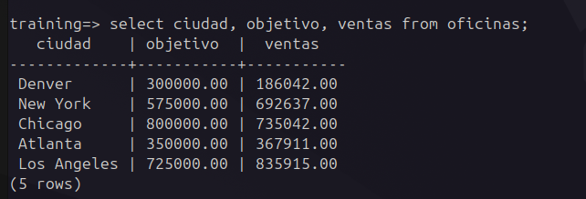
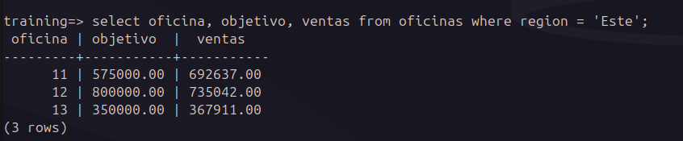
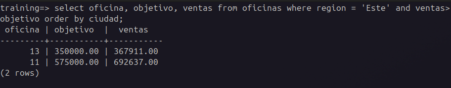

# Ejercicios de Consultas SELECT

A continuación, se presentan las consultas SQL para resolver los ejercicios propuestos utilizando la base de datos "training". Cada consulta está diseñada para ser clara, precisa y cumplir con los requisitos especificados. Se asume que las tablas relevantes incluyen **oficinas**, **empleados**, **clientes**, **pedidos**, y otras relacionadas, con columnas como **ciudad**, **region**, **ventas**, **objetivo**, **codemp**, **nombre**, **cuota**, **fecha_contrato**, **limite_credito**, **idproducto**, etc.

## Ejercicios y Consultas

1. **Lista de las oficinas de ventas con sus objetivos y ventas**  
```sql
SELECT ciudad, objetivo, ventas
FROM oficinas;
```


2. **Lista de las oficinas de ventas de la región Este con sus objetivos y ventas**  
```sql
SELECT oficina, objetivo, ventas
FROM oficinas
WHERE region = 'Este';
```

3. **Lista de las oficinas de ventas con sus objetivos y ventas de la región Este cuyas ventas exceden a sus objetivos, ordenadas alfabéticamente por ciudad**  
```sql
SELECT ciudad, objetivo, ventas
FROM oficinas
WHERE region = 'Este' AND ventas > objetivo
ORDER BY ciudad;
```

4. **Objetivos y ventas promedio para las oficinas de la región Este**  
```sql
SELECT AVG(objetivo) AS objetivo_promedio, AVG(ventas) AS ventas_promedio
FROM oficinas
WHERE region = 'Este';
```

5. **Nombre, cuota y ventas del empleado número 107**  
```sql
SELECT nombre, cuota, ventas
FROM empleados
WHERE codemp = 107;
```

6. **Ventas promedio de los vendedores**  
```sql
SELECT AVG(ventas) AS ventas_promedio
FROM empleados;
```

7. **Nombre y fecha de contrato de vendedores con ventas superiores a 500,000 ptas**  
```sql
SELECT nombre, fecha_contrato
FROM empleados
WHERE ventas > 500000;
```

8. **Ciudad, región y ventas por encima o por debajo del objetivo para cada oficina**  
```sql
SELECT ciudad, region, (ventas - objetivo) AS diferencia_ventas_objetivo
FROM oficinas;
```

9. **Efecto de elevar la cuota de cada vendedor un 3% de sus ventas anuales**  
```sql
SELECT nombre, cuota, cuota + (ventas * 0.03) AS nueva_cuota
FROM empleados;
```

10. **Nombre, mes y año de contrato para cada vendedor**  
```sql
SELECT nombre, MONTH(fecha_contrato) AS mes_contrato, YEAR(fecha_contrato) AS anio_contrato
FROM empleados;
```

11. **Ventas por ciudad, intercalando la frase 'tiene ventas de'**  
```sql
SELECT ciudad, 'tiene ventas de' AS descripcion, ventas
FROM oficinas;
```

12. **Oficinas donde las ventas exceden el objetivo (ciudad, ventas y objetivo)**  
```sql
SELECT ciudad, ventas, objetivo
FROM oficinas
WHERE ventas > objetivo;
```

13. **Empleados dirigidos por Bob Smith (empleado 104)**  
```sql
SELECT nombre
FROM empleados
WHERE director = 104;
```

14. **Vendedores contratados antes de 1988**  
```sql
SELECT nombre, fecha_contrato
FROM empleados
WHERE YEAR(fecha_contrato) < 1988;
```

15. **Oficinas cuyas ventas están por debajo del 80% del objetivo**  
```sql
SELECT ciudad, ventas, objetivo
FROM oficinas
WHERE ventas < (objetivo * 0.8);
```

16. **Oficinas cuyo objetivo no es 800,000 ptas**  
```sql
SELECT ciudad, objetivo
FROM oficinas
WHERE objetivo != 800000;
```

17. **Nombre y límite de crédito del cliente número 2107**  
```sql
SELECT nombre, limite_credito
FROM clientes
WHERE codcli = 2107;
```

18. **Pedidos con importe entre 20,000 y 29,999 (número e importe)**  
```sql
SELECT num_pedido, importe
FROM pedidos
WHERE importe BETWEEN 20000 AND 29999;
```

19. **Vendedores cuyas ventas no están entre el 80% y el 120% de su cuota**  
```sql
SELECT nombre, ventas, cuota
FROM empleados
WHERE ventas NOT BETWEEN (cuota * 0.8) AND (cuota * 1.2);
```

20. **Empresas cuyo nombre empieza por 'Smith' y su límite de crédito**  
```sql
SELECT nombre, limite_credito
FROM clientes
WHERE nombre LIKE 'Smith%';
```

21. **Productos cuyo ID comienza con 'A%BC'**  
```sql
SELECT idproducto
FROM productos
WHERE idproducto LIKE 'A%BC%';
```

22. **Vendedores que cumplen alguna de las siguientes condiciones:  
   a) Trabajan en Denver, New York o Chicago; o  
   b) No tienen director y fueron contratados a partir de junio de 2003; o  
   c) Están por encima de la cuota, pero tienen ventas de 600,000 o menos**  
```sql
SELECT nombre
FROM empleados
WHERE ciudad IN ('Denver', 'New York', 'Chicago')
   OR (director IS NULL AND fecha_contrato >= '2003-06-01')
   OR (ventas > cuota AND ventas <= 600000);
```

23. **Ventas de cada oficina, ordenadas alfabéticamente por región y dentro de cada región por ciudad**  
```sql
SELECT region, ciudad, ventas
FROM oficinas
ORDER BY region, ciudad;
```

24. **Oficinas clasificadas en orden descendente de ventas**  
```sql
SELECT ciudad, ventas
FROM oficinas
ORDER BY ventas DESC;
```

25. **Oficinas clasificadas alfabéticamente por región y dentro de cada región en orden descendente de rendimiento de ventas (rendimiento = ventas - objetivo)**  
```sql
SELECT region, ciudad, (ventas - objetivo) AS rendimiento
FROM oficinas
ORDER BY region, rendimiento DESC;
```

## Notas
- Las consultas asumen que las columnas mencionadas (como **ciudad**, **ventas**, **objetivo**, **cuota**, etc.) existen en las tablas correspondientes de la base de datos "training".
- Las funciones **MONTH** y **YEAR** se utilizan según lo indicado para extraer el mes y el año de fechas.
- Se emplean operadores como **LIKE**, **IN**, **BETWEEN**, y **IS NULL** para cumplir con las condiciones especificadas.
- Las consultas están optimizadas para ser claras y evitar duplicados innecesarios, aunque no se usa **DISTINCT** a menos que sea estrictamente necesario.